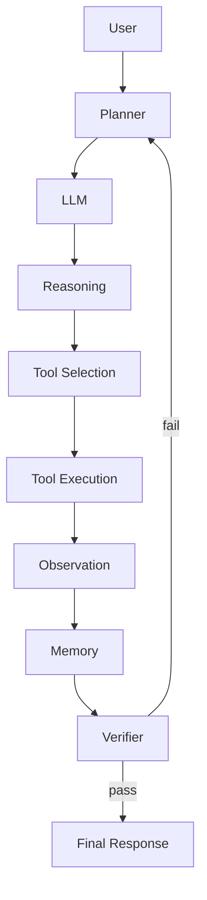
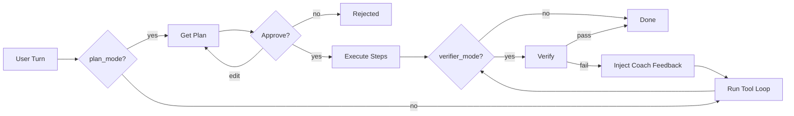
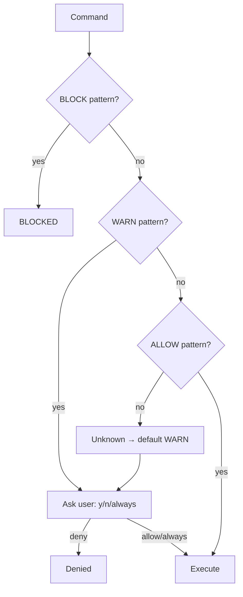
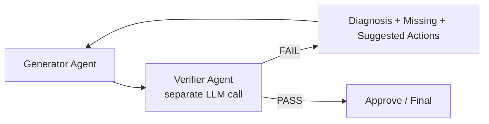

# Session 04: Advanced AI Agent Frameworks & Harness Engineering
---

## Table of Contents
1. [Introduction](#1-introduction)
2. [Agent Architecture](#2-agent-architecture)
3. [Harness Engineering](#3-harness-engineering)
4. [Code Walkthrough](#4-code-walkthrough)
5. [Loop Engineering](#5-loop-engineering)
6. [Tool Calling](#6-tool-calling)
7. [MCP](#7-mcp)
8. [Plugins vs Tools vs API vs MCP](#8-plugins)
9. [Sandboxed Execution](#9-sandbox)
10. [Safety & Prompt Injection](#10-safety)
11. [Verifier Architecture](#11-verifier)
12. [Ratchet](#12-ratchet)
13. [Memory](#13-memory)
14. [Multi-Agent Systems](#14-multi-agent)
15. [Interview Q&A](#15-qa)
16. [Cheat Sheets](#16-cheat-sheets)
17. [Glossary](#17-glossary)
18. [Production Notes](#18-production)
19. [Bridge to Multimodal Agents](#19-bridge)

---

<a id="1-introduction"></a>
## 1. Introduction

**LLM vs Agent**
- LLM = text in → text out, one shot, no hands, can't self-check.
- Agent = LLM + loop + tools + memory + (ideally) verification → can actually *do* things.

**Workflow vs Agent**
| | Workflow | Agent |
|---|---|---|
| Control | Fixed steps (developer-defined) | Decided at runtime by the LLM |
| Adapts to surprises? | No | Yes (re-plan, retry, self-correct) |
| Analogy | A recipe | A cook who tastes and adjusts |

**Why chatbots fail as "agents":**
- Can't touch real files/systems
- Can't verify their own claims
- No memory beyond current context
- No retry/observe loop — one shot per message

**Evolution chain:**
```
LLM → RAG (adds knowledge) → Tool Calling (can act) → Agent (loop + memory + verify) → Multi-Agent System
```
- RAG fixes "doesn't know your data" — not "can't act."
- Tool calling = LLM emits structured action instead of only prose.
- Agent = tool calling + loop + stopping conditions.

---

<a id="2-agent-architecture"></a>
## 2. Agent Architecture



**Why each layer exists:**
- **Planner** — prevents reacting one step at a time with no roadmap. → Plan Mode in `loop.py::_handle_plan_mode`
- **LLM** — the reasoning engine everything else compensates for
- **Reasoning** — turns vague goal into a specific next action
- **Tool Selection** — restricts LLM to a known, fixed set (no invented tools) → `tools.get_handler()` returns `None` for unknowns
- **Tool Execution** — only place real side effects happen → needs sandboxing/permissions
- **Observation** — tool output must be treated as *data*, not model speech
  - ⚠️ Bug found in code: tagging tool results as `"assistant"` confused the model into thinking it produced them → fixed by using `"user"` role + `[Tool Result]` prefix
- **Memory** — without it, every loop iteration starts from zero
- **Verifier** — a self-reported "done" isn't proof; a second LLM call checks the evidence
- **Loop** — enforces `MAX_ITERATIONS` so it can't spin forever
- **Final Response** — the only part the user actually sees

---

<a id="3-harness-engineering"></a>
## 3. Harness Engineering

**What is a Harness?**
> The code around the LLM that turns it from a text generator into a system that reliably gets things done: loop + tools + state + safety + verifier + persistent learning.

**Why prompts alone aren't enough** — a prompt can *ask*, only code can *enforce*:
- Hard iteration cap (`MAX_ITERATIONS = 8`)
- Refuse `block`-tier bash commands, no matter what the LLM decided
- Reject malformed JSON instead of trusting it

**Why companies use a harness:**
- Reliability — deterministic guardrails around a non-deterministic model
- Safety — classifier/permission layer outside the model's control
- Auditability — every action lives in `history`
- Reusability — swap LLM backend without touching tools/safety/loop

**Harness components → files:**
| Component | Role | File |
|---|---|---|
| Agent Runtime | Drives LLM↔tool cycles | `loop.py` |
| Control Layer | Plan/verifier modes, caps | `loop.py` |
| State Management | Conversation history | `memory.py` |
| Tool Registry | Schemas + handlers | `tools.py` |
| Safety Layer | ALLOW/WARN/BLOCK gate | `safety.py` |
| Verifier | Pass/fail + coaching | `verifier.py` |
| Ratchet | Mistake → rule pipeline | `rules.py`, `mistakes.py` |
| Planning | Structured plan before acting | `loop.py`, `real_llm.py` |
| Reflection/Retry | Feedback-driven re-execution | `loop.py` |
| Observability | Printed calls, previews, verdicts | `loop.py::_emit` |

---

<a id="4-code-walkthrough"></a>
## 4. Code Walkthrough

### `loop.py` — Agent Runtime
- **Does:** runs the REPL; each turn = up to `MAX_ITERATIONS` LLM↔tool cycles via `_run_once()`
- **Handles 3 action types:** `tool_call`, `final`, `plan`
- **Flow:** user text → append to history → loop → tool_call runs handler & appends `[Tool Result]` → final prints + stops → plan shows numbered steps, asks y/n/edit
- **Interview:** Why cap iterations? → guarantees termination. Why special-case `bash`? → only tool needing interactive permission + session pre-approval
- **Mistakes to avoid:** wrong message role for observations; no iteration cap; crashing on bad JSON instead of catching it

### `tools.py` — Tool Registry
- **Tools:** `read_file`, `write_file`, `edit_file`, `list_dir`, `glob`, `grep`, `bash`, `web_search`, `web_fetch`
- **Pattern:** every tool = plain function returning a string; `get_schemas()` / `get_handler()` / `list_names()` drive the registry
- `edit_file`: reads fresh each call → fails loudly on 0 or 2+ matches (unless `replace_all`) → exact-match surgical edits
- **Why `read_file` truncates at 4000 chars:** protects LLM context window
- **Why only `bash` goes through the safety classifier:** it's the only tool with destructive potential
- **Mistakes to avoid:** silent overwrites (`write_file` doesn't warn — LLM expected to `read_file` first); no timeout cap on `bash`

### `safety.py` — see [Section 10](#10-safety)
### `verifier.py` — see [Section 11](#11-verifier)
### `rules.py` + `mistakes.py` — see [Section 12](#12-ratchet)

### `memory.py` — Conversation State
- One `Message` TypedDict (role + content) + 4 functions: `init_history`, `add_user`, `add_assistant`, `last_user`
- LLM is stateless — "memory" = resending the full message list every turn
- Own docstring: no summarization, no RAG, no cross-session persistence — **deliberate MVP scope**

### `prompts.py` — System Prompt
- One `SYSTEM_PROMPT` describing the two JSON action shapes + ground rules
- Centralized so agent "personality" can change without touching loop logic

### `real_llm.py` — Real LLM Integration
- Talks to Anthropic SDK; builds tool list into prompt; converts schemas → Anthropic `input_schema`
- **3 modes on one `chat()` function:** normal tool-calling / `plan_mode` / `verifier_mode`
- **Temperature = 0.0 default** — comment says higher values "hallucinate / vary responses between runs," bad for deterministic JSON
- Plan-mode prompt gives explicit GOOD vs BAD step examples (few-shot contrast narrows output)

### `main.py` / `demo_test.py`
- `main.py`: loads `.env`, calls `agent.loop.run()`
- `demo_test.py`: monkey-patches `input()` with fixed sample prompts for reproducible testing

---

<a id="5-loop-engineering"></a>
## 5. Loop Engineering

**Loop types in this codebase:**
- **Agent Loop** — think → act → observe, capped at `MAX_ITERATIONS`
- **Planning Loop** — plan → approve/edit/reject → re-plan on edit
- **Verification Loop** — after `final`/plan completion, verifier checks; on FAIL, feedback re-injected, retried (up to 10x)
- **Retry Loop** — if a plan step skipped tools entirely, re-issue with a nudge
- **Reflection/Self-Correction** — verifier feedback includes diagnosis + missing items + suggested actions, not just "try again"

**Stopping conditions:**
| Condition | Purpose |
|---|---|
| `MAX_ITERATIONS = 8` | Cap cycles per turn |
| Verifier retry cap (10 / task) | Cap re-attempts |
| `action == "final"` | Normal successful exit |
| Malformed JSON | Hard-bail, don't retry blindly |
| User rejects plan | Early user-driven exit |

**Why infinite-loop prevention matters:** without a cap, a confused agent burns tokens/cost/side-effects indefinitely. A cap turns "silent infinite loop" → visible `[warn]` message.



---

<a id="6-tool-calling"></a>
## 6. Tool Calling

- **Schema** = `name` + `description` + `parameters`, exposed via `get_schemas()`
- Used to: (1) tell LLM what exists, (2) convert to Anthropic's `input_schema` format, (3) build human-readable signatures into the system prompt
- **Argument validation:** `args = action.get("args", {}) or {}` defensive default; handlers self-validate (e.g. `edit_file` fails cleanly on bad matches)
- **Error handling golden rule:** every handler call wrapped in try/except — a tool crashing must never crash the loop; exception becomes an `[error]` observation the model can reason about
- **Fallbacks:**
  - `bash` tries multiple shells in order, skips ones with "shim error" signatures
  - `web_fetch` has a bypass path between direct fetch and rendering proxy
- **Dynamic tools:** adding a tool = write function + add schema entry — loop auto-picks it up, no loop.py changes needed

---

<a id="7-mcp"></a>
## 7. MCP (Model Context Protocol)

> Note: this codebase hand-rolls its own tool registry rather than using MCP — but MCP is the standardized version of the same pattern.

- **What it is:** open protocol standardizing how an agent talks to external tools/data/prompts, so integrations aren't bespoke per app
- **Core concepts:**
  - **Client** — discovers/calls what a server exposes
  - **Server** — hosts and executes tools/resources/prompts
  - **Resources** — read-only data (≈ what `read_file`/`list_dir`/`grep` return here)
  - **Tools** — actions (≈ everything in `tools.py`)
  - **Prompts** — reusable templates
  - **Transport** — stdio (local) or HTTP/SSE (remote)
  - **Security/Auth** — connection-level gating, vs. this codebase's per-command `safety.classify()`
- **Why replacing custom integrations:** one MCP server (e.g. GitHub, Slack, filesystem) plugs into *any* MCP-compatible agent — no per-app adapter rewrite

**Comparison table:**
| | REST API | Plugin | Function Calling | MCP |
|---|---|---|---|---|
| Consumer | Any HTTP client | Specific host app | LLM call | Any MCP client |
| Discovery | Manual docs | App manifest | Per-request schema | Standard handshake |
| Portability | High, no LLM semantics | Low | Medium | High, provider-agnostic |

---

<a id="8-plugins"></a>
## 8. Plugins vs Tool vs API vs MCP Server vs Extension

- **Plugin** — packaged capability tied to one specific host app
- **Tool** — generic term for any callable capability (everything in `tools.py`)
- **API** — general network interface, not LLM-schema-aware
- **MCP Server** — standardized, protocol-compliant provider, any MCP client can use it
- **Extension** — browser/IDE add-on; may or may not expose anything to an LLM

**Examples:** GitHub (repo search/issues/PRs) · Slack (messages/channels) · Database (queries/schema) · Filesystem (read/write/list — standardized version of this project's file tools)

---

<a id="9-sandbox"></a>
## 9. Sandboxed Execution

**Why sandbox?** An agent with shell access can cause real damage — sandboxing bounds the blast radius.

**This codebase's lightweight approach:**
- **Timeouts** — every `bash` call clamped 1–120s
- **Output limits** — truncated at `_READ_CAP_CHARS` to avoid context blowup
- **Classification** — allow/warn/block gate before anything reaches a shell

**Production-grade options (beyond this demo):**
- **Docker** — container isolation, cheap, moderate strength
- **Firecracker (microVMs)** — near-VM isolation, container-like speed (used by AWS Lambda etc.) — current gold standard for untrusted code at scale
- **Restricted Python** — language-level sandbox, weaker, easy to escape if not audited
- **Memory/file limits** — cgroup-style resource caps
- **Internet restrictions** — network allow-lists to prevent exfiltration or malicious fetches

---

<a id="10-safety"></a>
## 10. Safety & Prompt Injection



**Three tiers:**
- **ALLOW** — read-only (`ls`, `cat`, `grep`, `git status`, `pytest`…) → runs silently
- **WARN** — mutating (`rm`, `mv`, `chmod`, `git commit/push`, `pip install`, `sudo`, `curl`/`wget`, piping into `sh`/`bash`) → needs y/n/always
- **BLOCK** — destructive (`rm -rf /`, fork bombs, `mkfs`, `dd of=/dev/*`, `shutdown`, `chmod 777 /`, `sudo rm`) → always refused, no override

**Precedence:** BLOCK > WARN > ALLOW. **Unknown commands default to WARN**, not ALLOW (safer failure mode).

**Prompt injection:**
- **Direct** — user tries to override system prompt directly → classifier still catches the resulting command regardless of intent
- **Indirect** — malicious instructions hidden in data the agent reads (a file, web page, tool output) → same defense: classify the *action*, not trust the model wasn't fooled

**Other risks:**
- **Data leakage** — file-read + network tools combo could exfiltrate secrets → `curl`/`wget` deliberately WARN-tier
- **Tool abuse** — allowed tool misused destructively (e.g. `find -exec rm`) → classifier does regex/substring search over whole command, so it still catches this
- **Secret exposure** — full command/output logging for observability can leak secrets in visible logs — needs redaction in production

**Verifier as a safety net too:** defaults to FAIL unless evidence clearly supports success — catches agents that *claim* success after doing something harmful or incomplete

---

<a id="11-verifier"></a>
## 11. Verifier Architecture



- **Separate LLM call** — `verify(goal, history)` judges strictly from the transcript, not from the agent's self-report
- **Default to FAIL** unless evidence clearly shows success
- **FAIL triggers:** ignored tool errors, partial work, wrong file edited, unverified claims, giving up early, asking clarifying questions when reasonable defaults existed

**"Coach" design — `Verdict` carries:**
- `diagnosis` — paragraph tied to the specific goal
- `missing` — concrete gap list
- `suggested_actions` — ordered, executable next steps
- → `to_feedback_message()` re-injects all of this into history, tells the agent to use tools again (not just describe)

**Backward compatibility:** also parses legacy `VERDICT: PASS|FAIL` format — good practice for evolving schemas without breaking old producers

---

<a id="12-ratchet"></a>
## 12. Ratchet — Persistent Learning

**What/why:** a mechanism that only moves forward — once a mistake becomes a rule, it persists and is retrievable later, so the same mistake class doesn't recur. Without it, every new session starts back at zero.

- Stored as plain Markdown in `DemoHarness.md` — human-readable, git-trackable, diffable

**Full pipeline:**
```
Detection → Extraction → Storage → Retrieval → Injection
```
- **Detection** (`mistakes.py`) — 3 signals:
  1. Verifier FAIL diagnostics already in history (most reliable)
  2. Tool errors (`[error]`, `Traceback`, `FileNotFoundError`, etc.)
  3. User push-back ("no", "wrong", "actually", "instead"…)
- **Extraction** — one meta-LLM call → 1–3 generalizable imperative rules (≤200 chars) with `why` + `category`
- **Storage** (`rules.py::log_rule`) — appends `## [Rxxx]` section + metadata (Logged/Category/Uses/Helpful)
- **Retrieval** (`rules.py::recall`) — keyword search; bumps `Uses` counter → gives data on which rules matter
- **Injection** — (next-lecture upgrade) feed recalled rules into future system prompts

**Manual vs Auto:**
- `/log_mistake <text>` — manual, forces human to articulate the lesson
- `/log_mistake` (no args) — auto-detects signals, then extracts rules via LLM

**Real example:**
```
[R001] After any read_file for a refactor task, immediately apply edits
with write_file/edit_file, then output a final summary with before/after
line counts.
→ Encodes: agent explored but never wrote the refactor back to disk.
```

---

<a id="13-memory"></a>
## 13. Memory

| Type | Description | In this codebase |
|---|---|---|
| Working/Short-term | Current turn's scratch state | `history`, appended live |
| Conversation | Full session back-and-forth | `memory.py` |
| Session | Scoped to one run, not persisted | `always_allow` set, mode flags |
| Long-term | Persists across sessions | `DemoHarness.md` (the Ratchet) — only thing that survives restart |
| Semantic/Vector | Meaning-based retrieval | **Not implemented** — `recall()` is plain substring search; upgrade path = embeddings |

- Memory here = literally a list of messages resent each turn — deliberately simple MVP, no summarization/RAG/persistence built in

---

<a id="14-multi-agent"></a>
## 14. Multi-Agent Systems

- This codebase = **one agent, multiple roles time-sliced through modes** (not separate persistent agents)

| This codebase | Full multi-agent equivalent |
|---|---|
| `chat(plan_mode=True)` | Dedicated **Planner** agent |
| `chat()` default | Dedicated **Executor/Coder** agent |
| `chat(verifier_mode=True)` | Dedicated **Verifier/Reviewer** agent |
| `extract_rules()` meta-call | Dedicated **Critic/Reflector** agent |

**Architectures:**
- **Manager–Worker** — coordinator dispatches to specialized workers
- **Hierarchical** — managers of managers, for deep task trees
- **Parallel** — independent agents work concurrently, merged after
- **Collaborative** — shared state/blackboard, negotiate rather than strict hierarchy

**Roles:** Planner (decompose) · Researcher (gather info) · Coder (execute changes) · Reviewer/Verifier (judge) · Coordinator (route work)

---

<a id="15-qa"></a>
## 15. Interview Q&A

- **Harness Engineering?** → Deterministic scaffolding around a non-deterministic LLM (loop, tools, safety, verifier, ratchet) — prompts alone can't enforce any of it.
- **Loop Engineering?** → Designing think→act→observe + stopping conditions so the agent progresses without spinning forever or failing silently.
- **Tool Calling vs MCP?** → Tool calling = provider-level structured function request. MCP = protocol-agnostic standard for whole servers of tools/resources/prompts, usually consumed *through* tool calling.
- **Why use a Verifier?** → Self-reported "final" isn't proof; a separate evidence-only check catches ignored errors/partial work/skipped steps.
- **Why not let the LLM run tools with no harness?** → No enforcement point for safety, caps, malformed-output handling, or auditability.
- **What is Ratchet?** → Detect mistake → extract rule → store durably → retrieve → inject, so the same failure doesn't recur across sessions.
- **What is Reflection?** → Structured feedback (diagnosis + missing + next steps) vs. a bare "try again."
- **Agent Memory?** → Simplest form = resending the full message list each turn; advanced = session state + long-term store + semantic retrieval.
- **RAG vs Agent?** → RAG augments knowledge via retrieval, doesn't let the model act. Agent wraps model in a loop with tools; RAG can be one tool inside an agent.
- **Planner vs Executor?** → Planner decomposes goal into steps before anything runs; Executor carries out each step with tools.
- **Why tier commands instead of always asking permission?** → Constant prompts train reflexive "yes" clicks; tiering saves human attention for real risk, and BLOCK removes override for catastrophic ones.
- **Why default unknown commands to WARN, not ALLOW?** → Fail-safe: unknown risk → ask, don't assume safe.
- **Risk of wrong message role for tool results?** → Model may conflate its own reasoning with external/untrusted data — documented bug in this codebase broke multi-turn reasoning.

---

<a id="16-cheat-sheets"></a>
## 16. Cheat Sheets

**Harness components**
```
Runtime       → drives LLM↔tool cycles
Control       → plan/verifier modes, iteration caps
State         → conversation history
Tool Registry → name + schema + handler, additive
Safety        → ALLOW / WARN / BLOCK
Verifier      → separate LLM call, evidence-only, coach feedback
Ratchet       → detect → extract → store → retrieve → inject
```

**Loop stopping conditions**
```
final action           → normal stop
MAX_ITERATIONS hit     → forced stop + warning
Malformed JSON         → bail this turn
Verifier PASS          → stop
Retries exhausted      → stop + warning
User rejects plan      → stop
```

**Safety tiers**
```
ALLOW → ls, cat, grep, git status/log, pytest → silent
WARN  → rm, mv, chmod, git commit/push, pip install, sudo, curl/wget → ask
BLOCK → rm -rf /, fork bomb, mkfs, dd of=/dev/*, shutdown, chmod 777 / → refused
Precedence: BLOCK > WARN > ALLOW. Unknown → WARN.
```

**MCP vs alternatives**
```
REST API          → generic, no LLM-native schema
Plugin            → host-app-specific, low portability
Function Calling  → per-request schema, provider-specific
MCP               → standardized, portable protocol
```

---

<a id="17-glossary"></a>
## 17. Glossary

- **Harness** — scaffolding (loop, tools, safety, verifier, memory) around an LLM
- **Loop** — think→act→observe cycle + hard stop condition
- **Reflection** — structured self/verifier critique with next steps
- **Planner** — decomposes goal into ordered steps before execution
- **Executor** — carries out planned steps via tools
- **Observation** — tool result fed back as data, not model speech
- **Scratchpad** — transient in-loop reasoning/tool-call trace
- **Ratchet** — persistent mistake→rule pipeline preventing regression
- **Verifier** — separate, evidence-driven pass/fail judge
- **Critic** — evaluates and generates improvement feedback (broader than pass/fail)
- **MCP** — standardized client/server protocol for tools/resources/prompts
- **Sandbox** — isolated execution limiting a tool's blast radius
- **Tool Registry** — closed, declared set of callable capabilities
- **State** — mutable data carried between loop iterations
- **Context Window** — token budget the harness must protect
- **Planning** — producing a structured, steppable plan before acting
- **Memory** — any mechanism carrying info across turns/sessions

---

<a id="18-production"></a>
## 18. Production Notes

> Conceptual, publicly-known patterns only.

- **Anthropic (Claude Code)** — agentic loop + tool registry (file ops, bash) + permission gating + plan→execute→verify cycles — a hardened version of this exact project
- **OpenAI** — function/tool calling as first-class API feature, with agent frameworks (planning, memory, MCP-style tools) layered on top
- **Google** — agent frameworks emphasizing structured planning + tool orchestration
- **Cursor / GitHub Copilot** — IDE-embedded agents; scoped tools (read/edit/test), diff-based edits (like this project's exact-match `edit_file`) for reviewability
- **Common theme:** none trust a single LLM call's self-report — all layer reviewable diffs, permission gates, and iteration caps, same shape as safety classifier + verifier + `MAX_ITERATIONS` here

---

<a id="19-bridge"></a>
## 19. Bridge to Multimodal Agents (Session 5)

**How does an agent become multimodal?** Two things widen, rest stays the same:

1. **Observation types** — tools return images/audio/structured visuals instead of only strings; loop's contract (`observation` → `history`) doesn't change, but message content needs non-text blocks
2. **Tool selection surface** — new tools that produce/consume non-text artifacts (e.g. "read this screenshot," "summarize this chart") — same Planner → Tool Selection → Execution → Observation pipeline, richer content types

**Safety/Verifier/Ratchet barely change conceptually** — a verifier judging "did the agent correctly describe this image" is the same evidence-driven pattern as judging a file refactor, just richer evidence format. That's why solid harness fundamentals now (loop, registry, safety, verifier, ratchet) carry straight into multimodality next session.
